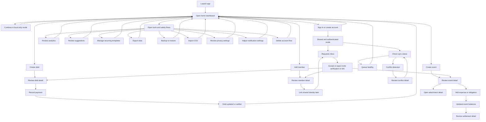

# Debtulator Navigation And User Flow Map

This file contains visual maps for both the navigation structure and the task-based user flow.

## Visual assets

### Navigation network


### User flow network


## 1. Navigation map

```mermaid
flowchart TD
    root[Root stack] --> tabs[Tab shell /(tabs)]

    tabs --> home[Home /]
    tabs --> debts[Debts /debts]
    tabs --> members[Members /members]
    tabs --> events[Events /events]
    tabs --> requests[Requests /requests hidden tab]
    tabs --> settings[Settings /settings hidden tab]

    home --> debtForm[Debt form /debt/form]
    home --> paymentForm[Payment form /payment/form]
    home --> expenseForm[Expense form /expense/form]
    home --> memberForm[Member form /member/form]
    home --> inbox[Requests inbox /requests]
    home --> debts

    debts --> debtDetail[Debt detail /debt/[id]]
    debts --> paymentDetail[Payment detail /payment/[id]]
    debts --> paymentForm

    members --> memberForm
    members --> memberDetail[Member detail /member/[id]]

    events --> eventForm[Event form /event/form]
    events --> eventDetail[Event detail /event/[id]]
    eventDetail --> expenseForm
    eventDetail --> expenseDetail[Expense detail /expense/[id]]
    eventDetail --> attachmentDetail[Attachment detail /attachment/[id]]
    eventDetail --> settlementDetail[Settlement detail /settlement/[id]]

    settings --> auth[Auth /auth]
    settings --> language[Language /language]
    settings --> notifications[Notifications /notifications]
    settings --> privacy[Privacy /privacy]
    settings --> accessibility[Accessibility /accessibility]
    settings --> sync[Sync /sync]
    settings --> backup[Backup /backup]
    settings --> export[Export /export]
    settings --> conflicts[Conflicts /conflicts]
    settings --> deleteAccount[Delete account /delete-account]

    export --> fullExport[Full export /full-export]
    conflicts --> conflictDetail[Conflict detail /conflict/[id]]

    menu[Global menu] --> home
    menu --> debts
    menu --> members
    menu --> events
    menu --> requests
    menu --> recurring[Recurring /recurring]
    recurring --> recurringForm[Recurring form /recurring/form]
    menu --> analytics[Analytics /analytics]
    menu --> suggestions[Suggestions /suggestions]
    menu --> export
    menu --> importCsv[Import CSV /import-csv]
    menu --> sync
    menu --> conflicts
    menu --> backup
    menu --> privacy
    menu --> notifications
```

## 2. User flow map



## Reading the diagrams

- The navigation map shows route accessibility and entry surfaces.
- The user flow map shows the main intent loops and exception paths.
- `Requests`, `Sync`, and `Conflicts` are the main collaboration and integrity control points.
- `Settings` and the global menu expose most trust and maintenance workflows that are intentionally kept outside the four primary browse tabs.
- The SVG diagrams above are the persisted visual deliverables; the Mermaid blocks below remain editable source views.
